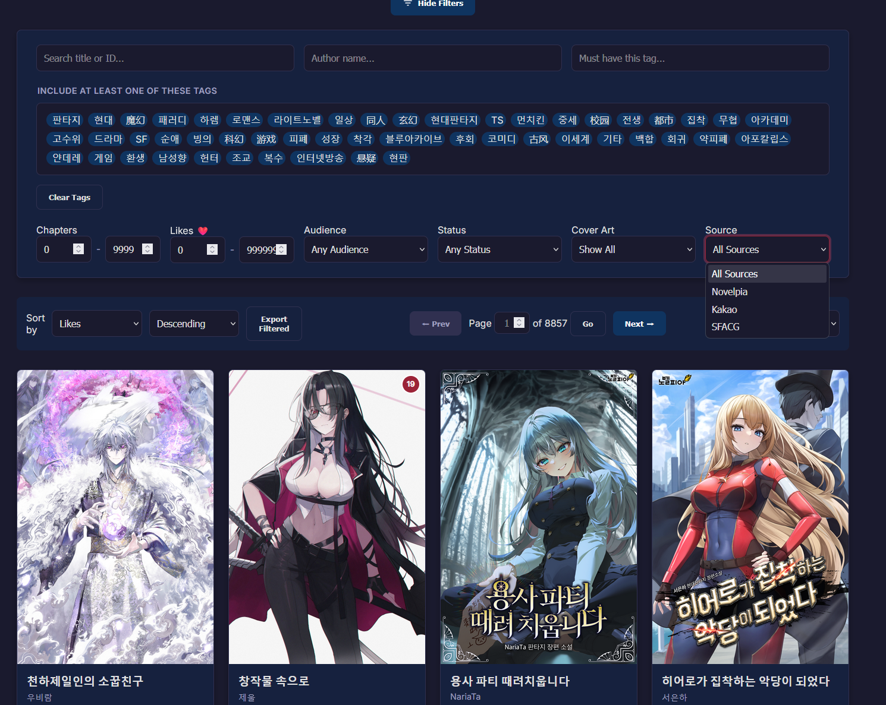

# Welcome to Your Korean Language Journey!
## Intro
Welcome to the beginning of your Korean language journey! This guide will walk you through the essential steps to get started with learning Korean effectively.

Let me first and foremost start with a small warning; this guide is still WIP. This guide is also HEAVILY influenced by [:octicons-arrow-right-24:Japanese Resources](japanese.md). Almost all of the Japanese resources are transferable with some work! Additional Korean Resources can be found in the [:octicons-arrow-right-24:Korean Resources](koreanresources.md) page.

If you want to contribute, open a github issue or pull request on [Github](https://github.com/SpazzTL/SpazzTL.github.io).

Now that we have the out of the way, here is some cruicial info for learning Korean! 

---

* Make sure to have a goal!

Having a concrete goal in mind will keep you motivated and most importantly CONSISTENT! It also lets you know how and what you should study. (e.g., reading, conversation, or speech).

* Don't use Duolingo.

Although fun, Duolingo and most other language learning apps are extremely inefficient, and made just to steal your time and money. They should be discarded after entering the beginning middle to upper phases of learning. That being said, if you enjoy Duolingo, it's better than nothing, and this is just an opinion... 

* Stay Consistent!

It's really that simple, just stay consistent. This is the most important part of language learning. Everything else is easy.

---

## Hangul: The Korean Alphabet

Your first step into learning Korean is mastering Hangul, the Korean alphabet. There are 24 basic characters to learn. Do not be concerned with the specific method of learning them – whether through writing or other resources.

Below are a few recommended resources to assist in learning Hangul:

* [90 Day Korean: Korean Alphabet A to Z](https://www.90daykorean.com/korean-alphabet-a-to-z/){target="_blank" rel="noopener"}
* [90 Day Korean: How to Learn the Korean Alphabet](https://www.90daykorean.com/how-to-learn-the-korean-alphabet/){target="_blank" rel="noopener"}
* [Vicky's Guide to Hangul](https://www.youtube.com/watch?v=85qJXvyFrIc){target="_blank" rel="noopener"}

---

## Vocab with Anki
Now its time to learn some vocab, and there exist few ways better than Anki for learning Vocabulary quickly and easily.
### Installation

[Anki](https://docs.ankiweb.net/platform/windows/installing.html){target="_blank" rel="noopener"} is an indispensable tool for language learning. It is a Spaced Repetition System (SRS)-based flashcard program that optimizes review schedules to maximize retention. Anki is free on Desktop (Windows, macOS, Linux) and Android devices. Please note that it costs $24.99 on Apple iOS devices.

### Setup

Setting up Anki is straightforward. A detailed setup guide is coming soon, but for now, general Anki setup guides for other languages or the default settings can be used.

#### Basic Setup Guide:
* Ensure FSRS is enabled.
* Use FSRS optimize features. 
* Set retention rate between 80%-90%
* Configure leeches threshold ( A leech is a word you consistently forget.)
* (JP Guides have a much more in-depth setup guide than here.)

=== "Settings 1"
    {height=300 width=600}
=== "Settings 2"
    {height=300 width=600}
=== "Settings 3"
    {height=300 width=600}
> Credit to [Lazy Guide](https://lazyguidejp.github.io/jp-lazy-guide/setup/)

  

Once Anki is installed, the true grind begins. Many excellent [pre-made Korean flashcard decks](https://ankiweb.net/shared/decks?search=korean){target="_blank" rel="noopener"} are available to kickstart vocabulary and grammar acquisition.

Some recommended decks include:

* [Korean Grammar Sentences by Evita](https://ankiweb.net/shared/info/3614346923){target="_blank" rel="noopener"}
* [Korean Vocabulary by Evita](https://ankiweb.net/shared/info/4066961604){target="_blank" rel="noopener"}
* [TTMIK's First 500 Korean Words](https://ankiweb.net/shared/info/1551455917){target="_blank" rel="noopener"}
* [Korean Vocabulary Core 2k/5k/10k](https://ankiweb.net/shared/info/994297597){target="_blank" rel="noopener"} 
* Make your own with an epub with Novel to Anki (Very scrappy, results will not be perfect) [Here](koreanresources.md)

**Start** with just one or two decks and aim to learn approximately 10-20 (or 40 if you have a lot of time) new words daily and diligently complete reviews.  The more new words you do, the more reviews you will have to do. At first the reviews may seem super easy and take no time, but within 1-2 weeks you will have 100-200 reviews per day. \
**Consistency** is paramount for making significant progress.  
**As new words** are learned, ensure engagement with Korean content through various resources such as textbooks, grammar guides, graded readers, and pronunciation guides.  
**Content choices** should align with specific learning goals (e.g., reading, conversation, or speech).

Some tips if you struggle with remembering new words:

* Write down the new words, sound them out as you do so, and think of the actual meaning/action/object, not the english meaning.
* Practice making sentences with the new words!
* Watch/Read/Engage with media where the word appears frequently.

#### Important Note:
Anki is ***not a*** magic wand, you can get good vocab through anki, but it *MUST* be used in conjunction with immersion of some kind for optimal and useable results. Try not to spend hours a day on Anki, while it can help, spending more than 30-45min a day has a large diminishing return. 

---

## The Grind: Immersion & Mining

This is often the most challenging, yet ultimately rewarding and time-consuming, part of language learning: immersion. Once a foundational vocabulary (recommended 500 words or more [Depends on content you want to engage with.]) is established, active engagement with Korean content and self-challenge can begin. Fortunately, several tools and workflows can make this process **much** easier and more bearable. 

### Yomitan: Popup Dictionary & Anki Integration

Yomitan is an incredibly useful browser extension that functions as a popup dictionary. Hovering over Korean text on a webpage will automatically display definitions and audio. Its main feature is Anki integration, allowing effortless "mining" of new cards. "Mining" refers to the process of encountering a new word, looking it up, and adding it to an Anki deck for later study.

#### Examples

=== "Yomitan Lookup"

    ### Looking up a Word with Yomitan
    This image demonstrates Yomitan in use while reading 꼬마 중위 in TTSU Reader.
    

=== "Anki Card"

    ### Word Card Added to Anki
    This screenshot displays a mined word in Anki. (Note: A custom Anki card setup is in use.)
    

#### Setup
First, install dictionaries for use in Yomitan. Downloading all dictionaries or the same ones is not required. 

IPA Dict provides pronounciation, Frequency gives relative frequency, ie: 1 = Most Common.

* Install [Frequency & IPA & KO-EN](https://github.com/Lyroxide/yomitan-ko-dic/releases){target="_blank" rel="noopener"} (Press 'Show all 30 assets') // Main recommended dictionary; sourced from (Korean Learners Dictionary) 
* Install [Hanja Dict](https://github.com/peldas/yomitan-dicts?tab=readme-ov-file#korean-english){target="_blank" rel="noopener"} // From a different source than above, provides better hanja lookup when used in conjunction with above.
* Install [jarjumarvins dict](https://github.com/jarjumarvin/yomichan_krdict/releases/tag/v1.1.0){target="_blank" rel="noopener"} // Provides a Hanja.zip which breaks down hanja. As well as krdict sourced from (Korean Learners Dictionary)

For Additional Coverage 

* [kty-ko-en.zip](https://pub-c3d38cca4dc2403b88934c56748f5144.r2.dev/releases/latest/kty-ko-en.zip){target="_blank" rel="noopener"} is a wiktionary that can help with some obscure words
 
* [SpazzTL's Supplemental Dictionary](https://github.com/SpazzTL/Supplemental-Korean-Dictionary){target="_blank" rel="noopener"}  is a  billingual dictionary I am making that will help with words missed by the other dictionaries, mainly words that appear in webnovels and manhwa. Currently no version out yet.

Installing overlapping dictionaries has no large downsides other than performance. \
Official Yomitan Dictionaries [here ](https://yomitan.wiki/dictionaries/){target="_blank" rel="noopener"}
##### Step by Step

=== "Step One"
    Press "Configure installed and enabled dictionaries."
    ### Importing Step 1
    
=== "Step Two"
    Press import and select all dictionaries to be imported. Then re-order as desired, referencing the example below.
    ### Importing Step 2
    

With dictionaries installed, open Yomitan settings and import settings using [this file](https://drive.google.com/file/d/12FBuZJ5jdv5z7pou3WZPY5cfOTZmUcfU/view?usp=sharing){target="_blank" rel="noopener"}.

Yomitan lookups should now function. Hold shift for bilingual lookups, and alt-shift for monolingual. To set up Anki, refer to other guides, such as [Moes Way](https://learnjapanese.moe/yomichan/){target="_blank" rel="noopener"} or the [Official Guide](https://yomitan.wiki/anki/){target="_blank" rel="noopener"}.

### Starting to Immerse 
Now that you have a basic setup of tools, you can start immersing easily! This is a massive milestone, as immersion will be where you learn the majority of your vocabulary and gain most of your understanding of the language. As with most of this guide, the JP guides go in more detail about immersion, and most of what they say will carry over. But some important things to keep in mind are:

* Engage with content you enjoy! Dont choose something super easy if you can't stand engaging with it.
* Consistency is key! Try to immerse a little every day. Ideally you should immerse more than you do Anki. 
* Don't worried if you struggle alot, struggle is normal in this step, attempt to find something a little easier to engage with and keep going! 
* Look at the resources guide and mess with your setup to find a setup you enjoy using. Almost all the resources will work on Android as well as Desktop.

## Resources:
Take a look at the [:octicons-arrow-right-24:Korean Resources](koreanresources.md) page for more resources. I have personally hand made a few, such as:

* [Novelpedia](https://github.com/SpazzTL/Novelpedia){target="_blank" rel="noopener"} To make it easier to find novels. 
* [Novelpia Downloader FORK](https://github.com/SpazzTL/NovelpiaDownloader){target="_blank" rel="noopener"}  A fork of  [CjangCjengh's NovelpiaDownloader](https://github.com/CjangCjengh/NovelpiaDownloader){target="_blank" rel="noopener"} with some additional features. 
* [Novel to Anki](https://github.com/SpazzTL/Novel-To-Anki){target="_blank" rel="noopener"} To convert webnovels (in epub or txt format) into anki decks. (IS VERY BASIC, RESULTS WILL NEED TUNING)
* [Yomitan Dictionary Tool](https://github.com/SpazzTL/Supplemental-Korean-Dictionary) Using the Yomitan Word Adder.pyw makes it easy to add words to an existing dictionary or make your own: 