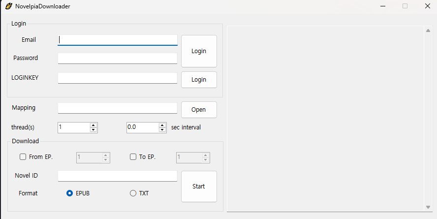
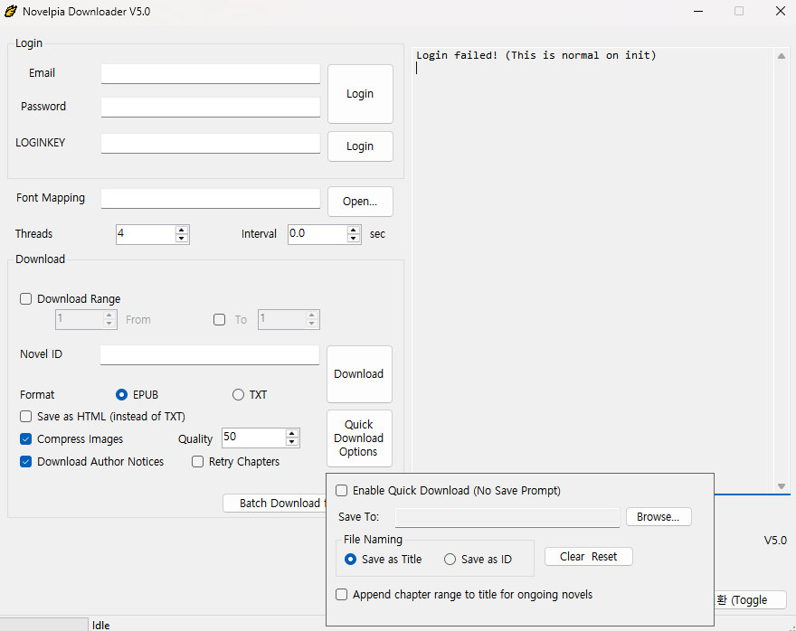
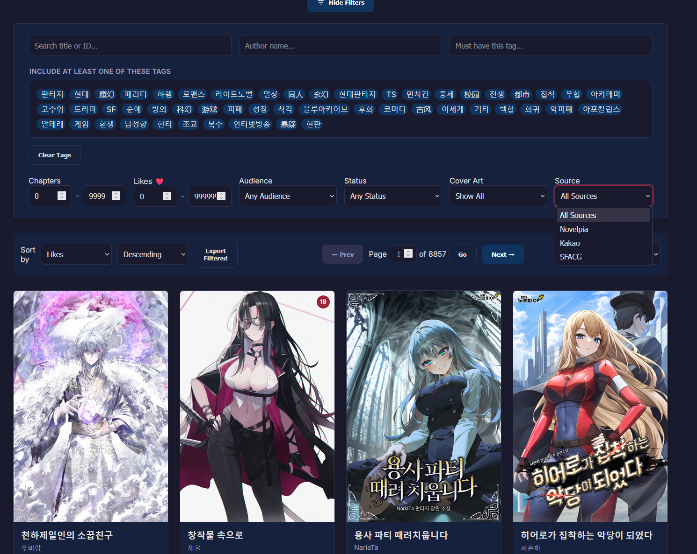

# Books
* <a href="https://learnnatively.com/" target="_blank" rel="noopener">Natively</a> To find media suited for your skill level.
* <a href="https://novelpia.com/" target="_blank" rel="noopener">Novelpia</a> Official site containing popular korean webnovels. (See #Tools Novelpia Downloader)

---
# Audio

---     
# Video 

---
# Tools 
* <a href="https://github.com/CjangCjengh/NovelpiaDownloader/releases" target="_blank" rel="noopener">Novelpia Downloader</a> Download Novelpia novels you have access to (requires novelpia account). 
* <a href="https://github.com/SpazzTL/NovelpiaDownloader" target="_blank" rel="noopener">My Fork of Novelpia Downloader</a> Adds a bunch of features such as: Improved EPUB Formatting, File Size Optimization, Author Notices Support.
* <a href="https://spazztl.github.io/Novelpedia/" target="_blank" rel="noopener">Novelpedia</a> A website I made to easily search and filter Korean (and Chinese currently.) webnovels. Useful for finding something to read. 
* <a href="https://yomitan.wiki/" target="_blank" rel="noopener"> Yomitan </a> A browser extension that lets you use a pop-up dictionary. The reason for so many of the below resources being browser based. 
* <a href="https://reader.ttsu.app" target="_blank" rel="noopener"> TTSU Reader </a> Great web based epub reader (made for japanese, character counter does NOT work in korean). 
* <a href="https://peldas.github.io/ebook-reader-korean/manage" target="_blank" rel="noopener"> Korean Fork of TTSU Reader </a> A OLD fork that works better with Korean (Does not receive updates). (if you dont need the character counter/progress bar/reading stats, original works fine otherwhise use this or my fork below.)
* <a href="https://spazztl.github.io/korean-ebook-reader/manage" target="_blank" rel="noopener"> My Korean Fork of TTSU Reader </a> An updated version of Peldas's (the above link.) Requires setup in settings, will not get support from me. (change text layout to horizontal.)
* <a href="https://github.com/killergerbah/asbplayer" target="_blank" rel="noopener"> ASB Player </a> Great multi-lingual video player!
* <a href="https://github.com/SpazzTL/Novel-To-Anki" target="_blank" rel="noopener"> Novel to Anki </a> Script I made; Take a epub or txt and convert it into a anki deck, with sentences and definitions. (Requires tinkering!)
* <a href="https://github.com/SpazzTL/Supplemental-Korean-Dictionary/tree/main" target="_blank" rel="noopener">Supplemental Korean Dictionary </a>My WIP Dictionary (not yet available) and a custom program I made to make a custom Yomitan dictionary much easier. Or modify an existing one.
* <a href="https://github.com/kaihouguide/Mangatan?tab=readme-ov-file#for-pc-desktop" target="_blank" rel="noopener">Mangatan</a> Similar to the Japanese OCR [Mokuro](https://github.com/kha-white/mokuro){target="_blank" rel="noopener"}, allows you to read Manhwa in your browser with Yomitan support. 

---
# More Resources (Sites ETC)
* <a href="https://www.reddit.com/r/Korean/comments/hw4gy0/the_ultimate_beginners_resource_thread/" target="_blank" rel="noopener"> Reddit Beginner Korean Megathread </a>
* <a href=https://www.reddit.com/r/Korean/comments/3rqfwo/the_ultimate_intermediate_learners_resource_thread/ target="_blank" rel="noopener"> Reddit Intermediate Korean Megathread </a>
---

